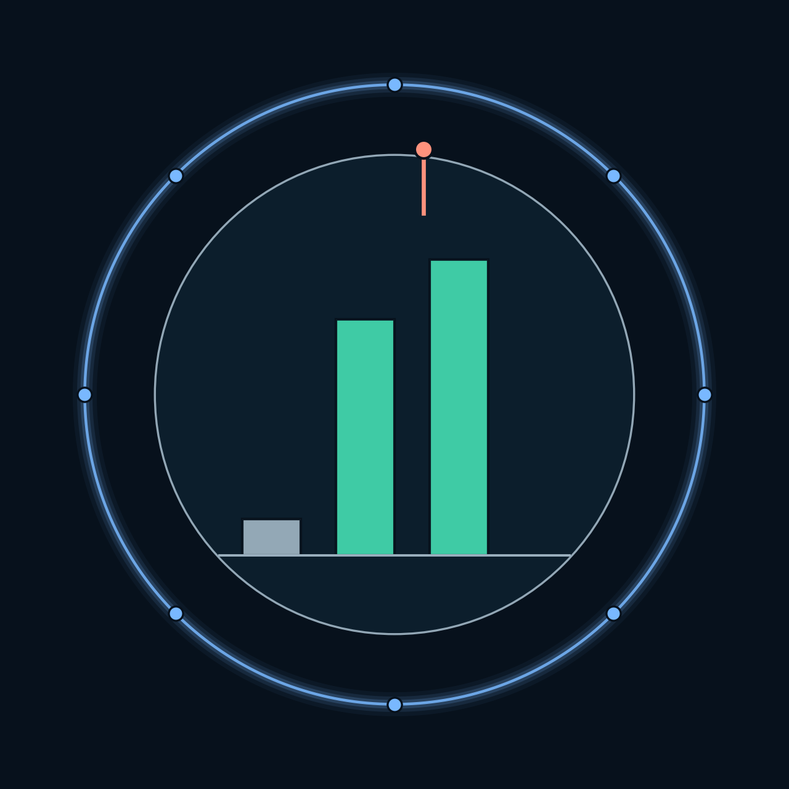
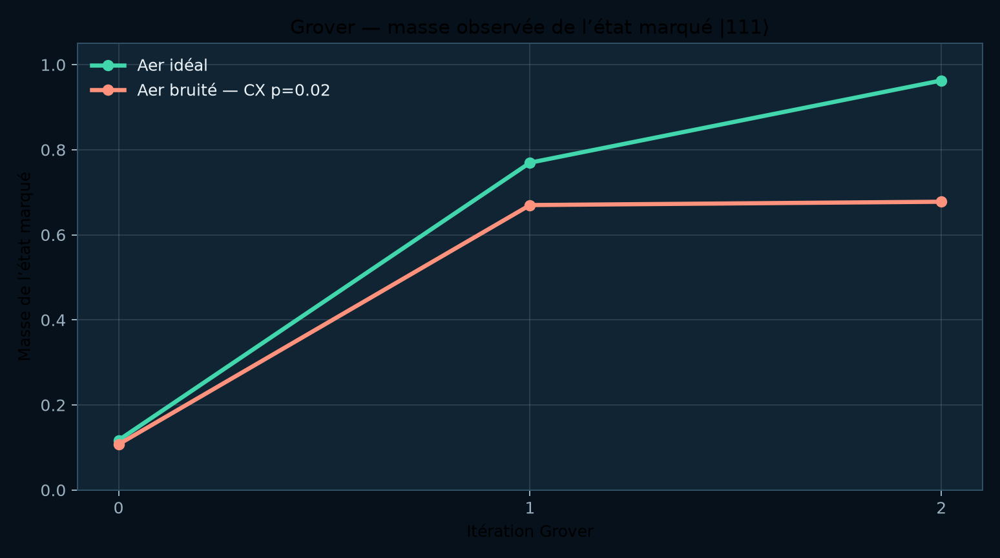
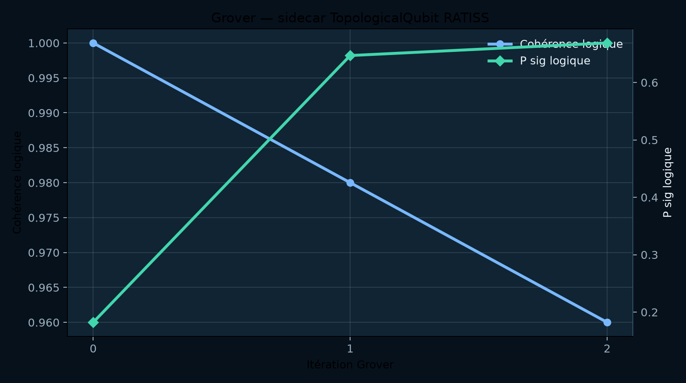
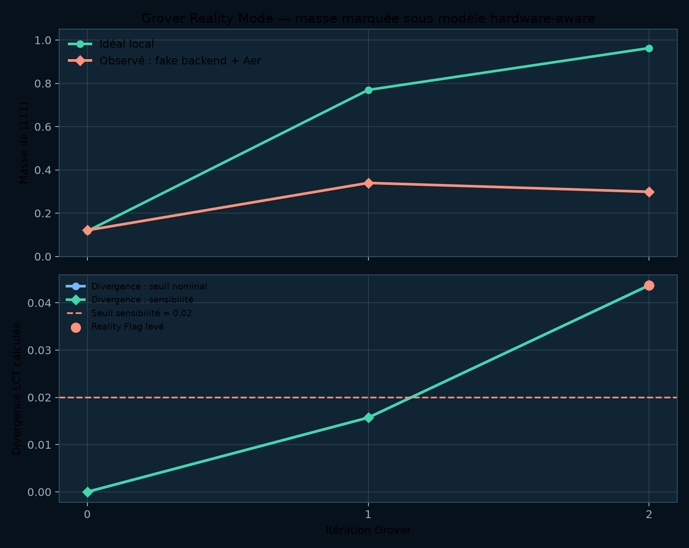
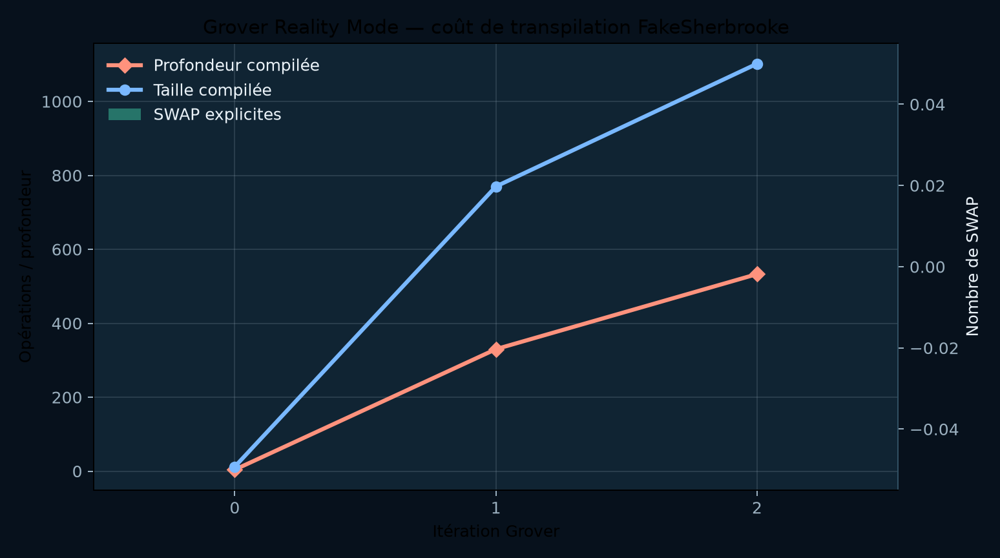

<p align="center">
  
</p>

<h1 align="center">Algorithmes quantiques RATISS Labs</h1>

<p align="center">
  <strong>Banc d'expériences de circuits quantiques</strong><br/>
  Grover sous simulation Aer · comparaison idéal/bruité · Reality Mode hardware-aware —<br/>
  sidecar topologique RATISS lu dans un flux strictement séparé.
</p>

<p align="center">
  <a href="LICENSE"></a>
  
  
  
  
  
</p>

<p align="center">
  <em>Architecte & investigateur principal : <strong>Jonathan Evina</strong> ·
  <a href="https://orcid.org/0009-0000-4092-5313">ORCID 0009-0000-4092-5313</a></em>
</p>

---

## Sommaire

1. [Nature du banc d'expériences](#1-nature-du-banc-dexpériences)
2. [Frontière de revendication](#2-frontière-de-revendication)
3. [Expérience 1 — Grover et sidecar RATISS](#3-expérience-1--grover-et-sidecar-ratiss)
4. [Expérience 2 — Reality Mode hardware-aware](#4-expérience-2--reality-mode-hardware-aware)
5. [Correction de sidecar et régénération](#5-correction-de-sidecar-et-régénération)
6. [Expérience 3 — Validation contre un QPU IBM réel](#6-expérience-3--validation-contre-un-qpu-ibm-réel)
7. [Pile technologique](#7-pile-technologique)
8. [Exécution et reproduction](#8-exécution-et-reproduction)
9. [Tests](#9-tests)
10. [Documentation du laboratoire](#10-documentation-du-laboratoire)
11. [Citation et licence](#11-citation-et-licence)

---

## 1. Nature du banc d'expériences

Ce laboratoire vérifie concrètement une trajectoire simple : un oracle de phase et la diffusion Grover amplifient l'état marqué `|111⟩` dans le simulateur idéal ; un canal de bruit déclaré modifie la distribution. Le côté RATISS ne remplace pas Grover : il produit un **second flux de variables topologiques logicielles**, explicitement séparé de l'algorithme quantique.

| Type de projet | Objet quantique | Objet RATISS | Produit de recherche |
|---|---|---|---|
| Algorithme quantique reproductible | Recherche Grover, oracle de phase pour `|111⟩` | `TopologicalQubit` algorithmique | Counts, masse de l'état marqué, phase, cohérence et `P_sig` logique |

## 2. Frontière de revendication

> **Aucune ligne de ce dépôt ne prétend que la LCT optimise Grover, corrige le bruit ou décrit un qubit topologique matériel.** Le sidecar est une simulation algorithmique versionnée. Le Reality Mode utilise un faux backend empaqueté (`FakeSherbrooke`) comme source locale de topologie et de bruit ; aucun job QPU n'est soumis, et le Reality Flag n'est pas un diagnostic de matériel réel.

## 3. Expérience 1 — Grover et sidecar RATISS



La courbe vert menthe représente les counts Aer idéaux ; la courbe corail vient du même circuit sous bruit CX dépolarisant `p=0.02`. La masse observée de `|111⟩` atteint `0.962891` à l'itération 2 dans l'idéal et `0.677734` sous ce bruit déclaré.



Cette figure ne représente pas une propriété calculée à partir de l'état Grover seul. Elle suit le sidecar `TopologicalQubit` à l'horloge des itérations. Son `P_sig` oscille librement selon ses transformations ; il n'est pas fixé pour suivre la masse Grover.

| Itération | Masse `|111⟩` idéale | Masse `|111⟩` bruitée | `P_sig` logique RATISS | Cohérence logique |
|---:|---:|---:|---:|---:|
| 0 | 0.117188 | 0.107422 | 0.182162 | 1.00 |
| 1 | 0.769531 | 0.669922 | 0.646956 | 0.98 |
| 2 | 0.962891 | 0.677734 | 0.668866 | 0.96 |

Ces valeurs viennent de [`artifacts/grover_ratiss.json`](artifacts/grover_ratiss.json), avec seed `42` et `512` tirs. Elles peuvent changer lorsque la configuration, le seed, le bruit, l'oracle ou le nombre de tirs changent ; le dépôt conserve la configuration avec les sorties.

## 4. Expérience 2 — Reality Mode hardware-aware



Le Reality Mode ajoute un second protocole, séparé de l'expérience historique : Qiskit transpile Grover vers le *target* et la topologie de couplage empaquetés par `FakeSherbrooke`, puis Aer utilise le modèle de bruit local dérivé de ce faux backend. L'allocation physique déclarée est `[0, 14, 26]` ; la profondeur compilée passe de `4` à `330` puis `533` aux itérations 0, 1 et 2. Le transpileur n'a exporté aucun `swap` explicite dans cette exécution, mais a décomposé le circuit dans le jeu de portes de la cible.



Le moniteur reçoit les counts observés, construit une association de counts RATISS séparée, puis compare la masse marquée et les sidecars idéal/observé. Son **Reality Flag** est une condition LCT déclarée, pas un diagnostic d'un QPU réel. Depuis la correction du sidecar (voir §5), le seuil nominal `0.15` est franchi aux itérations 1 et 2 (divergences `0.169988` et `0.526472`) ; le scénario de sensibilité séparé, à seuil `0.02`, se déclenche aux mêmes itérations.

| Itération | Masse idéale | Masse observée fake backend | Profondeur compilée | Divergence LCT nominale | Reality Flag nominal | P_sig association counts |
|---:|---:|---:|---:|---:|---:|---:|
| 0 | 0.117188 | 0.121094 | 4 | 0.000000 | Non | 0.0 |
| 1 | 0.769531 | 0.339844 | 330 | 0.169988 | **Oui** | 0.0 |
| 2 | 0.962891 | 0.298828 | 533 | 0.526472 | **Oui** | 0.0 |

## 5. Correction de sidecar et régénération

> **Transparence de laboratoire.** Les artefacts précédents affichaient une signature sidecar initiale de `1.214413`. Cette valeur provenait d'un bug connu du `TopologicalQubit` — des cycles dégénérés (naissance ≈ mort, ~1e-16) comptés comme persistants — corrigé dans le moteur ([PR #1](https://github.com/evinajonathan13-max/ratiss-topological-decoherence-engine/pull/1) : tolérance `1e-9`, géométrie dilatante twist 0→π, amplitude de bruit `0.2`). L'anneau compact non tordu donne désormais `P_sig ≈ 0.18`, et le sidecar réagit réellement à la dégradation mesurée. Tous les artefacts de ce dépôt ont été régénérés avec le moteur corrigé ; les valeurs ci-dessus sont les valeurs corrigées, conservées sans ajustement.

## 6. Expérience 3 — Validation contre un QPU IBM réel

Le Reality Mode hors ligne (`FakeSherbrooke`, §4) reste la référence reproductible sans réseau. Une seconde validation soumet les **trois itérations** du circuit Grover (`oracle |111⟩`) à un **vrai backend IBM** et compare la divergence LCT entre la simulation Aer locale et le résultat matériel réel. L'artéfact [`artifacts/grover_qpu_validation.json`](artifacts/grover_qpu_validation.json) conserve les **Job IDs traçables** par itération, les counts matériels et le Reality Flag calculé contre le matériel réel.

```bash
IBM_QUANTUM_TOKEN=... python3 scripts/run_grover_qpu_validation.py \
  --engine-src ../ratiss-topological-decoherence-engine/src \
  --backend ibm_marrakesh --shots 512
```

> **Frontière de revendication.** Le Reality Flag compare la simulation Aer au matériel réel ; il ne certifie pas le matériel et n'est pas un diagnostic d'anomalie IBM. Le **couplage LCT-ETH n'est pas appliqué ici** : il requiert une matrice densité (disponible dans [COSMOS](https://github.com/evinajonathan13-max/QPU-Ratiss-COSMOS), pas dans des counts Grover). C'est la frontière transdisciplinaire honnête entre les deux laboratoires. Le token IBM est lu uniquement depuis la variable d'environnement `IBM_QUANTUM_TOKEN` ; il n'est jamais écrit dans l'artéfact, le dépôt ni aucun log.

| Itération | Masse idéale | Masse Aer bruitée | Masse **QPU réel** | Divergence Aer | Divergence QPU | Reality Flag (0.15) |
|---:|---:|---:|---:|---:|---:|---:|
| 0 | 0.125 | 0.107 | 0.139 | 0.000000 | 0.000000 | Non |
| 1 | 0.781 | 0.670 | 0.676 | 0.003899 | 0.003493 | Non |
| 2 | 0.945 | 0.678 | **0.727** | 0.109358 | 0.059000 | Non |

> **Lecture honnête.** À l'itération 2, le QPU réel `ibm_marrakesh` atteint une masse marquée `0.727` — **supérieure** à la simulation Aer bruitée (`0.678`). Le matériel réel converge mieux vers l'état marqué que le canal dépolarisant `p=0.02` d'Aer : le bruit matériel réel est, sur ce circuit et ce backend, moins dégradant que le modèle de bruit déclaré. Les divergences LCT restent sous le seuil nominal `0.15` aux trois itérations. Trois Job IDs traçables sont conservés dans l'artéfact : `da5uajeaa69c739latgg`, `da5uituaa69c739lb6m0`, `da5ujreaa69c739lb7m0`.

### Diagnostic classique des counts

Un diagnostic classique (Shannon + TVD) complète la masse dominante. À l'itération 2, le **TVD du QPU réel** (`0.273`) est plus bas que celui d'Aer (`0.322`) : la distribution complète du matériel réel diverge moins de l'idéal que la simulation, pas seulement la masse marquée. Ce diagnostic est étiqueté `classical_counts_diagnostic_not_quantum_entropy` — l'entropie de Shannon des counts n'est pas l'entropie de von Neumann, et `ETH` ne peut pas être approximé à partir de counts sans tomographie (explosion exponentielle refusée).

## 7. Pile technologique

| Couche | Technologie | Rôle |
|---|---|---|
| Langage | Python ≥ 3.11 | Banc d'expériences complet |
| Simulation quantique | Qiskit 2.5.2 · Qiskit Aer 0.17.2 | Échantillonnage Grover, canaux de bruit déclarés |
| Faux backend | Qiskit IBM Runtime 0.49.0 (`FakeSherbrooke`) | Target, carte de couplage, modèle de bruit local — hors ligne |
| Topologie | Vietoris-Rips (GF(2), moteur RATISS) | Association de counts, `P_sig` |
| Sidecar | `TopologicalQubit` (moteur RATISS, corrigé) | Variables topologiques logicielles séparées |
| Visualisation | Matplotlib | Figures dérivées exclusivement des artefacts JSON |
| Tests | pytest | Contrats de données et règle du Reality Flag |
| Artefacts | JSON versionné | `ratiss.grover.sidecar.v1`, `ratiss.grover.reality_mode.v1` |

Le moteur topologique source ([`ratiss-topological-decoherence-engine`](https://github.com/evinajonathan13-max/ratiss-topological-decoherence-engine)) est une dépendance **explicite par chemin local** — la provenance reste visible.

## 8. Exécution et reproduction

```bash
git clone https://github.com/evinajonathan13-max/Algorithmes-quantique-Ratiss-labs-.git
git clone https://github.com/evinajonathan13-max/ratiss-topological-decoherence-engine.git
cd Algorithmes-quantique-Ratiss-labs-
python3 -m pip install -e .

# Expérience 1 : Grover + sidecar
PYTHONPATH=../ratiss-topological-decoherence-engine/src \
python3 scripts/run_grover_ratiss.py \
  --engine-src ../ratiss-topological-decoherence-engine/src \
  --output artifacts/grover_ratiss.json --shots 512

# Expérience 2 : Reality Mode nominal (seuil 0.15)
PYTHONPATH=../ratiss-topological-decoherence-engine/src \
python3 scripts/run_grover_reality_mode.py \
  --engine-src ../ratiss-topological-decoherence-engine/src \
  --output artifacts/grover_reality_mode.json --shots 512

# Expérience 2 bis : scénario de sensibilité (seuil 0.02)
PYTHONPATH=../ratiss-topological-decoherence-engine/src \
python3 scripts/run_grover_reality_mode.py \
  --engine-src ../ratiss-topological-decoherence-engine/src \
  --output artifacts/grover_reality_mode_sensitivity.json \
  --reality-flag-lct-threshold 0.02

# Figures dérivées des seuls artefacts
python3 scripts/generate_docs_figures.py
```

Deux exécutions successives du même artefact produisent un contenu **bit-pour-bit identique**.

## 9. Tests

```bash
PYTHONPATH=../ratiss-topological-decoherence-engine/src python3 -m pytest -q
```

Les tests vérifient que le circuit reste à trois qubits avec trois mesures, que la masse marquée est dérivée des counts fournis (non d'une constante), que les artefacts conservent les sorties brutes, et que le Reality Flag suit exactement la règle déclarée `divergence > seuil` dans les deux scénarios.

## 10. Documentation du laboratoire

| Document | Ce qu'il apporte |
|---|---|
| [`PROTOCOL.md`](docs/PROTOCOL.md) | Construction de l'oracle et comparaisons autorisées |
| [`ARCHITECTURE.md`](docs/ARCHITECTURE.md) | Séparation Grover / sidecar RATISS |
| [`RESULTS.md`](docs/RESULTS.md) | Observations exactes de l'exécution courante |
| [`VISUAL_AUDIT.md`](docs/VISUAL_AUDIT.md) | Validation de lecture des graphiques |
| [`REALITY_MODE.md`](docs/REALITY_MODE.md) | Contrat du faux backend, Reality Flag et scénarios de seuil |
| [`REALITY_MODE_VISUAL_AUDIT.md`](docs/REALITY_MODE_VISUAL_AUDIT.md) | Vérification des graphiques Reality Mode |

## 11. Citation et licence

Distribué sous [licence MIT](LICENSE) — © 2026 Jonathan Evina.

```bibtex
@software{evina_ratiss_labs_grover_2026,
  author  = {Evina, Jonathan},
  title   = {Algorithmes quantiques RATISS Labs: Reproducible Grover
             and RATISS Logical-Sidecar Experiments},
  year    = {2026},
  url     = {https://github.com/evinajonathan13-max/Algorithmes-quantique-Ratiss-labs-},
  note    = {Simulation locale reproductible ; aucune exécution sur matériel.}
}
```
