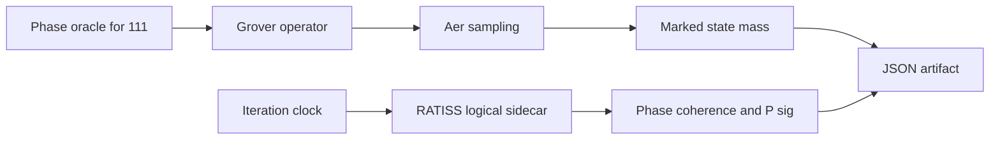

# Algorithmes quantique RATISS labs

# Algorithmes quantiques RATISS Labs

> **Banc d’expériences de circuits quantiques** — Grover sous simulation Aer, comparaison idéal/bruité et lecture séparée d’un sidecar topologique RATISS.

| Type de projet | Objet quantique | Objet RATISS | Produit de recherche |
|---|---|---|---|
| Algorithme quantique reproductible | Recherche Grover, oracle de phase pour `|111⟩` | `TopologicalQubit` algorithmique | Counts, masse de l’état marqué, phase, cohérence et `P_sig` logique |

Ce laboratoire vérifie concrètement une trajectoire simple : un oracle de phase et la diffusion Grover amplifient l’état marqué dans le simulateur idéal ; un canal de bruit déclaré modifie la distribution. Le côté RATISS ne remplace pas Grover : il produit un **second flux de variables topologiques logicielles**, explicitement séparé de l’algorithme quantique.

> Aucune ligne de ce dépôt ne prétend que la LCT optimise Grover, corrige le bruit ou décrit un qubit topologique matériel. Le sidecar est une simulation algorithmique versionnée.

## Visuels issus de l’artefact exécuté


La courbe vert menthe représente les counts Aer idéaux ; la courbe corail vient du même circuit sous bruit CX dépolarisant `p=0.02`. La masse observée de `|111⟩` atteint `0.962891` à l’itération 2 dans l’idéal et `0.677734` sous ce bruit déclaré.


Cette figure ne représente pas une propriété calculée à partir de l’état Grover seul. Elle suit le sidecar `TopologicalQubit` à l’horloge des itérations. Son `P_sig` oscille librement selon ses transformations ; il n’est pas fixé pour suivre la masse Grover.

## Architecture



L’architecture détaillée est dans [`docs/ARCHITECTURE.md`](docs/ARCHITECTURE.md). La séparation des branches de calcul est une contrainte centrale : les résultats Grover et RATISS sont enregistrés dans le même artefact, mais ne sont jamais convertis l’un dans l’autre.

## Résultats calculés

| Itération | Masse `|111⟩` idéale | Masse `|111⟩` bruitée | `P_sig` logique RATISS | Cohérence logique |
|---:|---:|---:|---:|---:|
| 0 | 0.117188 | 0.107422 | 1.214413 | 1.00 |
| 1 | 0.769531 | 0.669922 | 0.763344 | 0.98 |
| 2 | 0.962891 | 0.677734 | 0.768691 | 0.96 |

Ces valeurs viennent de [`artifacts/grover_ratiss.json`](artifacts/grover_ratiss.json), avec seed `42` et `512` tirs. Elles peuvent changer lorsque la configuration, le seed, le bruit, l’oracle ou le nombre de tirs changent ; le dépôt conserve la configuration avec les sorties.

## Exécution locale

```bash
git clone https://github.com/evinajonathan13-max/Algorithmes-quantique-Ratiss-labs-.git
git clone https://github.com/evinajonathan13-max/ratiss-topological-decoherence-engine.git
cd Algorithmes-quantique-Ratiss-labs-
python3 -m pip install -e .

PYTHONPATH=../ratiss-topological-decoherence-engine/src \
python3 scripts/run_grover_ratiss.py \
  --engine-src ../ratiss-topological-decoherence-engine/src \
  --output artifacts/grover_ratiss.json --shots 512
```

## Tests

```bash
PYTHONPATH=../ratiss-topological-decoherence-engine/src python3 -m pytest -q
python3 scripts/generate_docs_figures.py
python3 -m json.tool artifacts/grover_ratiss.json >/dev/null
```

Les tests vérifient que le circuit construit reste à trois qubits avec trois mesures et que la masse marquée est dérivée des counts fournis, non d’une constante attendue.

## Documentation du laboratoire

| Document | Ce qu’il apporte |
|---|---|
| [`PROTOCOL.md`](docs/PROTOCOL.md) | Construction de l’oracle et comparaisons autorisées |
| [`ARCHITECTURE.md`](docs/ARCHITECTURE.md) | Séparation Grover / sidecar RATISS |
| [`RESULTS.md`](docs/RESULTS.md) | Observations exactes de la première exécution |
| [`VISUAL_AUDIT.md`](docs/VISUAL_AUDIT.md) | Validation de lecture des graphiques |

Distribué sous [licence MIT](LICENSE).
