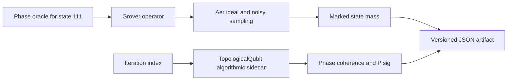

# Architecture Grover × RATISS

Le sidecar prend l’index d’itération comme horloge expérimentale, mais il n’est pas injecté dans l’oracle, la diffusion ou la mesure Grover. Cette séparation rend visible une co-évolution de deux objets logiciels sans attribuer automatiquement l’un à l’autre.
