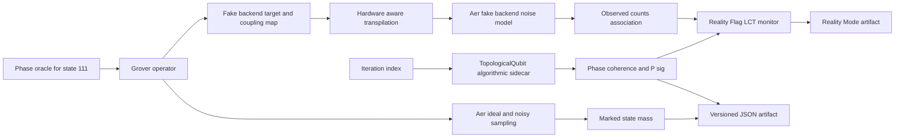

# Architecture Grover × RATISS

Le sidecar prend l’index d’itération comme horloge expérimentale, mais il n’est pas injecté dans l’oracle, la diffusion ou la mesure Grover. Cette séparation rend visible une co-évolution de deux objets logiciels sans attribuer automatiquement l’un à l’autre.

La voie Reality Mode ajoute un target et un modèle de bruit provenant d’un faux backend IBM empaqueté. Les counts observés produisent une association classique distincte ; le Reality Flag compare les divergences déclarées sans faire de diagnostic matériel ni modifier le circuit historique.
